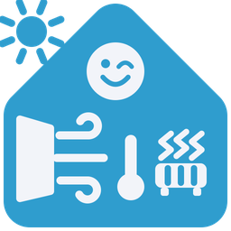

# NaPohodu

Integrace pro Home Assistant, která v každé místnosti udržuje zvolenou
teplotu a kvalitní vzduch. Rozhoduje, kterým prostředkem toho dosáhnout,
a hlídá, aby si topení, větrání a stínění nelezly do cesty.

## Jak je to poskládané

Celý model stojí na dvou pojmech. Pochopit rozdíl mezi nimi je klíč
k tomu, aby nastavení dávalo smysl.

### Místnost

**Místo, kde měříš a kde chceš být spokojený.** Má svoje čidla, topení,
okna, žaluzie a lidi. Rozhoduje se za sebe a ovládá svoje pohony.

Do místnosti svítí slunce, v místnosti se spí, v místnosti je nebo není
někdo doma. Všechno, co se dá ukázat prstem, patří místnosti.

### Oblast

**Místnosti, které spolu dýchají.** Průchozí prostor, otevřené dveře.
Vzduch se v nich míchá, takže nemá smysl počítat CO2 zvlášť — bere se
nejhorší hodnota z celé oblasti a vyvětrat ji může kterékoli okno.

Oblast sama nic neovládá. Nemá okna ani žaluzie, neposílá povely. Jen
říká, co spolu souvisí.

**Místnost, která s ničím nesousedí, oblast nepotřebuje.** Rozhoduje se
sama za sebe a nic jí nechybí.

### Proč zrovna takhle

Dřív okna patřila oblasti a rychle se ukázalo, proč to nefunguje. Když
má každá místnost svoje okno, musel bys zakládat oblast na každou z nich,
přestože nic nepropojuje. A vznikala nesouměrnost: žaluzie patřily
místnosti, okna oblasti, i když obojí visí na téže stěně.

Rozdělení je teď jednoduché. **Cokoli, co se ovládá, patří místnosti.
Oblast je jen informace o tom, že vzduch teče i mezi nimi.**

Příklad: kuchyň a obývák jsou průchozí, tvoří oblast. Ložnice za dveřmi
je samostatná. Obě si nastavíš jako sousední, aby se v noci mohly
zastoupit — když se v ložnici spí, vyvětrá ji kuchyňské okno a nefouká
ti na hlavu.

## Co to umí

### Adaptivní cílová teplota

Počítá se z klouzavého průměru venkovní teploty za týden podle
EN 16798-1. V zimě vychází níž, v létě výš, protože se člověk aklimatizuje.
Ovládáš jediný posuvník s odchylkou, zvlášť pro každou místnost.

Průměry si integrace počítá sama exponenciálním průměrem, takže
nepotřebuje statistické senzory ani historii. Vlastní čidlo můžeš zadat
a přebije ten počítaný.

### Větrání podle vzduchu i teploty

CO2, prach a slovní kvalita vzduchu, každé s mrtvou zónou, aby okno
neposkakovalo. Jakmile větrání začne, pokračuje až pod dolní práh —
mrtvá zóna brání zahájení, ne dokončení.

Délka větrání se řídí **skutečným ochlazením místnosti**, ne stopkami.
Časovač je jen pojistka. Posuvník *vzduch proti teplu* říká, o kolik smí
teplota klesnout.

Rosný bod z Magnusova vzorce zkracuje větrání, když hrozí kondenzace.
Teplota se bere tak, jak ji čidlo hlásí — žádné dopočítávání, které by
za rok nikdo nedokázal ověřit.
Prachu se nevěří, když čidlo právě neměří — u čidel s ventilátorem se
zadá jeho spínač.

### Nárazové větrání

Když je venku chladněji než cílová teplota, stojí každé větrání teplo.
V takové chvíli je krátký průvan všemi okny naráz účinnější než dlouhé
větrání jedním oknem — vzduch se vymění rychleji a stěny se nestihnou
vychladit.

Stačí, aby vzduch potřebovala jedna místnost, a otevřou se všechna okna,
kterým v tom nic nebrání. Vítr, déšť, noční mez nebo prázdný byt
zůstávají v platnosti a okno tam prostě zavřené zůstane.

Nárazové větrání smí jít pod běžnou spodní hranici třiceti minut, protože
o krátkost tady jde. Ve výchozím stavu je vypnuté.

### Zastupování mezi oblastmi

Někdy je větrání v jedné oblasti drahé a v sousední ne. Dva různé důvody,
stejný důsledek: když se v místnosti spí, větrání budí; když je pod
cílovou teplotou, stojí teplo a okno kmitá sem a tam.

V obou případech vezme vzduch za ni soused za otevřenými dveřmi. Dostane
její CO2, takže otevře dřív, než by musel kvůli sobě, a ona se sama
otevře až při krizi.

Nefunguje to, když by u souseda větrání stálo totéž — tam by se problém
jen přestěhoval o místnost dál.

### Ruční zásah

Když okno otevřeš nebo zavřeš rukou, integrace to pozná — skutečnost se
rozejde s tím, co naposledy poslala. Rozdělané větrání se tím ruší a
půl hodiny se do okna nemluví. Pak se čeká na nový podnět: vyšší CO2,
jiná teplota, příchod noci.

Smyslem je, aby se automatika s člověkem nepřetahovala. Bez toho by po
uplynutí doby držení stavu poslala povel znovu.

**Vítr a déšť platí dál.** Ochrana bytu stojí nad ručním rozhodnutím
stejně jako nad automatikou.

Totéž u žaluzií. Po každém povelu si integrace zapamatuje, na jaké
poloze skutečně skončily, a porovnává ji se skutečností. Když se
rozejde, stav zapomene a příště ho nastaví znovu.

### Prach a co s ním

Prach je jediná veličina, kterou větrání umí zhoršit. Když je venku hůř
než uvnitř, otevřením se natáhne dovnitř a hodnota roste — takže by se
větralo donekonečna.

Se zadaným venkovním čidlem se porovnávají hodnoty přímo. Bez něj se to
integrace naučí z chování: když prach uvnitř při otevřeném okně stoupá,
tahá se zvenčí, a poznatek pár hodin platí.

Na prach se ostatně větrat nemusí. Čistička ho vyřeší bez tepelné
ztráty a v zimě je to skoro vždycky lepší volba.

### Noční režim

Jedno dlouhé provětrání místo několika krátkých. Zavírá se podle teploty,
ne podle času. Vyšší práh CO2, aby to nebudilo, a nouzové provětrání nad
krizovou mezí. Ráno se od zvolené hodiny už neotevírá, ale rozjeté
větrání se nechá doběhnout.

Když má oblast souseda za otevřenými dveřmi, vyvětrá ji raději on.

### Stínění

Sluneční zisk se počítá pro každé okno zvlášť z jeho azimutu a polohy
slunce, korigovaný naměřeným zářením. Stíní se jen tam, kam svítí.

Žaluzie se ovládají **pojmenovanými stavy**. Pohony, které neumí naklápět
lamely přímo, se řídí posloupností kroků — najeď na procenta, počkej,
zastav za jízdy. Posloupnosti se ladí testerem přímo v nastavení a
ukládají pod jménem, kterých může být kolik chceš.

U každé místnosti se nastaví, **kdy vůbec smí automatika sahat**: vždy,
jen když nikdo není doma, nebo nikdy. A zvlášť zatahování po setmění kvůli
soukromí, buď hned nebo až když někdo do místnosti přijde.

### Sdílená klimatizace

Vnitřní jednotka v jedné místnosti patří té místnosti a řídí se sama.
Jednotka, která obsluhuje celý byt, je jiný případ — musí se rozhodnout,
komu vyhoví. Pro ni se zakládá **sdílená klimatizace** jako třetí typ
vedle místnosti a oblasti.

Cíl se počítá ve stupnici místnosti, kde jednotka fyzicky stojí, protože
tu měří nejlíp. Podle toho, o kolik jsou ostatní počítané místnosti nad
cílem, se dotlačí dolů — nejvýš o dva stupně, aby místnost s jednotkou
nezmrzla. Prázdné a nepočítané místnosti cíl netahají, takže dílna
nechladí celý byt.

**Otevřené okno jednotku nevypne, když je venku tepleji než cíl.** Okno
je tehdy otevřené kvůli vzduchu a tahá dovnitř teplo, takže chladit je
potřeba právě teď. Vypne se jen tehdy, když okno chladí zadarmo.

Při nepřítomnosti se cíl drží dál, protože rozhoupat byt zpátky je
dražší než ho udržet. Na útlum se přejde až při dlouhé nepřítomnosti,
buď přepínačem, nebo automaticky po zvolené době.

Cíl se posílá jen při skutečné změně — aspoň půl stupně a nejčastěji
jednou za patnáct minut. Kompresor ani člověk nemá rád, když se hodnota
vrtí každou minutu.

### Topení

Integrace posílá hlavicím cílovou teplotu a režim. Funguje na virtuální
hlavici z Better Thermostatu i na skutečnou, protože používá jen běžné
`set_temperature` a `set_hvac_mode` — o kalibraci a regulaci se stará
hlavice sama.

| situace | teplota | režim |
|---|---|---|
| v sezóně | cíl místnosti | nechává se hlavici |
| mimo topnou sezónu | 7,7 °C | nechává se hlavici |
| otevřené okno, hlavice to umí | cíl místnosti | nechává se hlavici |
| otevřené okno, hlavice to neumí | 5,5 °C | nechává se hlavici |
| začátek sezóny | 28 °C | heat |

**Teplota se posílá vždycky**, protože bez ní hlavice neví, na co
regulovat. Mění se jen ta hodnota.

Zvláštní čísla místo vypnutí mají svůj smysl: z hodnoty poznáš, že povel
dorazil od integrace a proč. Better Thermostat posílá při otevřeném okně
5,0, takže naše 5,5 jde odlišit. Kulaté číslo by se pletlo s ruční
obsluhou. Obě hodnoty se dají změnit.

**Co hlavice zvládne sama, do toho integrace nemluví.** Je to hlavní
zásada celého napojení na topení, protože dvě věci, které rozhodují
o jedné, se vždycky začnou přetahovat.

Otevřené okno je toho příklad. Integrace hlavici posílá okenní senzor,
podle kterého si topení vypne sama a po zavření se vrátí tam, kde byla.
Posílat jí k tomu ještě útlumovou teplotu by byla druhá informace o téže
věci. Volba **Při otevřeném okně** ale dovolí útlum nebo vypnuto zapnout
— hodí se u hlavice, která okenní senzor neumí.

Totéž platí o sezóně. Better Thermostat si podle venkovní teploty
určuje sám, kdy topit, a jeho hranice nemusí souhlasit s tou naší.
Ve výchozím nastavení proto integrace mimo sezónu do topení nemluví
vůbec, takže se na přechodu nehádají. Vypnutím volby **Sezónu si řídí
hlavice sama** převezme rozhodování integrace.

Aby bylo poznat, co se doopravdy děje, ukazuje se v atributech vedle
sebe obojí: `topeni` je to, co poslala integrace, a `topeni_hlavice`
to, co hlásí sama hlavice. Když se rozejdou, je to vidět na první
pohled.

**Odvzdušnění.** Když integrace zaznamená přechod do topné sezóny, drží
zvolenou dobu vysokou teplotu, aby ventil zůstal plně otevřený a rozvod
se odvzdušnil sám. Přebíjí i otevřené okno, protože je to jednorázová
věc. Nula hodin znamená neodvzdušňovat.

### Zvlhčovač, čistička, odtah

Kromě oken a topení umí integrace ovládat i pomocná zařízení, každé
podle toho, co skutečně řeší.

**Čistička** řeší prach, ne CO2. V zimě a v noci je lepší než otevřít
okno, protože nechladí a nehučí.

**Odtah** řeší vlhkost. Pomůže i tehdy, když je venku vlhčeji než
uvnitř, kdy by okno situaci zhoršilo.

**Zvlhčovač** řeší opačný problém. V zimě vysychá vzduch pod třicet
procent, což už vysušuje sliznice.

Povel jde vždy jen při změně. Opakované zapínání už zapnuté čističky nic
nezlepší.

### Obsazenost z více důkazů

Pohybové čidlo nevidí sedícího člověka a po vybití baterie zamrzne.
Proto se počítá i s vedlejšími důkazy — televize, světla, odběr
v zásuvce. Každý má vlastní doběh a zdroj, který se dlouho neozval, se
ignoruje.

Obsazenost a klid jsou dvě nezávislé věci. Ložnice bývá neobsazená, ale
v noci vyžaduje klid.

### Zprávy

Posílá se přes notify entity, takže příjemce vybereš ze seznamu — u
Telegramu vytváří integrace jednu entitu na každý chat. Zaškrtneš, co tě
zajímá: zavření kvůli větru nebo dešti, nouzové provětrání, otevírání
a zavírání, chyby pohonu, denní souhrn.

Stejná zpráva se neopakuje dřív než za půl hodiny. Automatika, která
upozorňuje pořád, se přestane číst.

### Karta na dashboard

Nastavení → NaPohodu → Nastavit → **Karta na dashboard** vypíše hotový
YAML poskládaný z entit, které opravdu existují. Zkopíruješ a vložíš.
Po přidání místnosti si přijdeš pro novou verzi.

### Diagnostika

Když se nic neděje, atribut `duvody` u stavu místnosti vyjmenuje
**všechny** překážky naráz, ne jen tu první. Odstranit jednu a divit se,
že to nepomohlo, je snadné — proto celý seznam.

Atribut `dnes` shrne den: kolikrát se okno hýbalo, jak dlouho bylo
otevřeno, nejvyšší CO2, nejnižší teplota. Podle toho se pozná, jestli
jsou prahy dobře nastavené.

## Co to nedělá

Neřeší regulaci samotné hlavice — kalibraci podle externího čidla,
adaptaci, předehřívání. Na to je
[Better Thermostat](https://github.com/KartoffelToby/better_thermostat)
nebo vlastní algoritmus hlavice. NaPohodu jim posílá cíl a virtuální
okenní senzor, takže se topení vypne i v místnosti, jejíž okno je jinde.

Nepočítá polohu žaluzií podle azimutu za tebe. Používá pojmenované
polohy, které si vyladíš testerem — u pohonů, které neumí naklápět
lamely přímo, je to jediná cesta k rozumnému výsledku.

## Instalace přes HACS

1. HACS → tři tečky vpravo nahoře → **Vlastní repozitáře**
2. Vlož adresu tohoto repozitáře, typ **Integrace**
3. Najdi **NaPohodu**, stáhni, restartuj Home Assistant
4. Nastavení → Zařízení a služby → Přidat integraci → NaPohodu

Všechno se nastavuje ve formulářích. Do `configuration.yaml` se nesahá.

## Ladění žaluzií

Nastavení → Zařízení a služby → NaPohodu → **Nastavit** → *Tester žaluzií*.

Posloupnost se píše jedním řádkem: `0, 5s, 14, 3s, 12.7`. Číslo je poloha
v procentech, `3s` je čekání, `=5` počká na potvrzení polohy, `stop`
zastaví za jízdy, `tilt 40` naklopí lamely. Když výsledek sedí, uložíš ho
pod jménem.

Pro každou přiřazenou roli vznikne u místnosti tlačítko, takže se
stínění dá vyvolat rukou bez psaní automatizace. Uložené stavy jdou
vyvolat i službou `napohodu.nastav_stineni` nebo
`napohodu.stineni_mistnosti`, takže je můžeš dát na tlačítko.

## Bezpečnostní zásady

Integrace nesáhne na nic, dokud to nepovolíš. Každá místnost má tři
přepínače — **Ovládat okno**, **Ovládat žaluzie** a **Ovládat topení** —
a všechny jsou po založení vypnuté. Sdílená klimatizace má svůj.

Najdeš je jako entity na kartě zařízení té místnosti, ne v konfiguračním
dialogu. Je to schválně: vypnout automatiku má jít jedním klepnutím
z dashboardu, ne procházením nastavení.

Dokud jsou vypnuté, integrace jen počítá a ukazuje, co by udělala. Ve
stavu místnosti to poznáš podle atributu `ovladani`.

Po startu se žaluziemi nehýbe. Předpokládá, že jsou tam, kde mají být —
rozjet je jen proto, že se integrace znovu načetla, znamená zarachotit
bez důvodu. Srovnat se dá tlačítkem.

Ochrana stojí nad tvým rozhodnutím: vítr a déšť zavřou okno i tehdy, když
jsi ho otevřel ručně nebo vynutil přepínačem.

Naopak všechno ostatní tvoje rozhodnutí respektuje. Ruční zásah zruší
rozdělanou akci, vynucené otevření přebije vzduch i teploty a přepínače
ovládání vypnou automatiku úplně.

## Ikona

Obrázky jsou ve složce `custom_components/napohodu/brand/` jako
`icon.png`, `icon@2x.png`, `logo.png` a `logo@2x.png`.

Od Home Assistanta 2026.3 si vlastní integrace nosí obrázky s sebou
a nemusí je nikam hlásit. Místní soubory mají přednost před repozitářem
značek, který pro vlastní integrace už nové žádosti ani nepřijímá.

Ikona se objeví v seznamu integrací i na stránkách zařízení. V HACS se
zatím nemusí zobrazit, protože ten si obrázky tahá z vlastní služby —
je to známá věc a na funkci to nemá vliv.

## Licence

MIT, viz soubor [LICENSE](LICENSE).

## Poděkování

NaPohodu nepřebírá kód z jiných projektů, ale některé postupy vznikly
inspirací:

- [Adaptive Cover](https://github.com/basbruss/adaptive-cover) (MIT) —
  kaskáda priorit jako pojmenovaný seznam pravidel místo vnořených
  podmínek.
- [Better Thermostat](https://github.com/KartoffelToby/better_thermostat)
  (AGPL-3.0) — detekce otevřeného okna z poklesu teploty přes
  exponenciální klouzavý průměr.

**Pozor při přispívání:** Better Thermostat je pod AGPL-3.0. Do NaPohody
se z něj nesmí kopírovat kód, jinak by celý projekt musel na AGPL přejít.
Inspirovat se chováním je v pořádku, myšlenky autorské právo nechrání.
