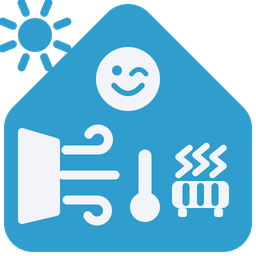

# NaPohodu

Integrace pro Home Assistant, která v každé místnosti udržuje zvolenou
teplotu a kvalitní vzduch. Rozhoduje, kterým prostředkem toho dosáhnout,
a hlídá, aby si topení, větrání a stínění nelezly do cesty.

## Jak je to poskládané

Celý model stojí na dvou pojmech. Pochopit rozdíl mezi nimi je klíč
k tomu, aby nastavení dávalo smysl.

### Místnost

**Místo, kde měříš a kde chceš být spokojený.** Má svoje čidla, topení,
okna, žaluzie a lidi. Rozhoduje se za sebe a ovládá svoje pohony.

Do místnosti svítí slunce, v místnosti se spí, v místnosti je nebo není
někdo doma. Všechno, co se dá ukázat prstem, patří místnosti.

### Oblast

**Místnosti, které spolu dýchají.** Průchozí prostor, otevřené dveře.
Vzduch se v nich míchá, takže nemá smysl počítat CO2 zvlášť — bere se
nejhorší hodnota z celé oblasti a vyvětrat ji může kterékoli okno.

Oblast sama nic neovládá. Nemá okna ani žaluzie, neposílá povely. Jen
říká, co spolu souvisí.

**Místnost, která s ničím nesousedí, oblast nepotřebuje.** Rozhoduje se
sama za sebe a nic jí nechybí.

### Proč zrovna takhle

Rozdělení je jednoduché. **Cokoli, co se ovládá, patří místnosti.
Oblast je jen informace o tom, že vzduch teče i mezi nimi.**

Příklad: kuchyň a obývák jsou průchozí, tvoří oblast. Ložnice za dveřmi
je samostatná. Obě si nastavíš jako sousední, aby se v noci mohly
zastoupit — když se v ložnici spí, vyvětrá ji kuchyňské okno a nefouká
ti na hlavu.

## Co to umí

### Adaptivní cílová teplota

Počítá se z klouzavého průměru venkovní teploty za týden podle
EN 16798-1. V zimě vychází níž, v létě výš, protože se člověk aklimatizuje.
Ovládáš jediný posuvník s odchylkou, zvlášť pro každou místnost.

Průměry si integrace počítá sama exponenciálním průměrem, takže
nepotřebuje statistické senzory ani historii. Vlastní čidlo můžeš zadat
a přebije ten počítaný.

**Zimní přitápění.** Adaptivní norma je psaná na letní komfort
v přirozeně větraných budovách: čím tepleji venku, tím vyšší teplotu
lidé doma snesou. V zimě se proto jen opře o dolní hranici a dál nic.

Přitom v mrazu chladnou stěny a okna, klesá střední radiační teplota
a člověku je při stejném vzduchu chladněji, protože do studených ploch
vyzařuje vlastní teplo. Integrace to dorovnává: pod nastaveným prahem
přičte k cíli podíl toho, o kolik je venku chladněji, a po nastaveném
náběhu se zastaví na plné hodnotě — hlubší mrazy už na tom nic nemění.
Se výchozím prahem 7 °C a plným stupněm od 4,5 °C to odpovídá tomu, co
se v praxi osvědčilo. Je to vědomé doplnění normy, ne její oprava, a dá
se vypnout nulovým prahem.

Z čeho se cíl skládá, je vidět v diagnostice — základ z křivky,
přitápění i společný posun zvlášť.

### Větrání podle vzduchu i teploty

CO2 a prach, obojí s mrtvou zónou, aby okno
neposkakovalo. Jakmile větrání začne, pokračuje až pod dolní práh —
mrtvá zóna brání zahájení, ne dokončení.

Délka větrání se řídí **skutečným ochlazením místnosti**, ne stopkami.
Časovač je jen pojistka. Zadává se rovnou, o kolik stupňů smí teplota
klesnout — zvlášť ve dne a zvlášť v noci, protože v noci se snese víc.

Rosný bod z Magnusova vzorce zkracuje větrání, když hrozí kondenzace.
Teplota se bere tak, jak ji čidlo hlásí — žádné dopočítávání, které by
za rok nikdo nedokázal ověřit.
Prachu se nevěří, když čidlo právě neměří — u čidel s ventilátorem se
zadá jeho spínač.

### Nárazové větrání

Když je venku chladněji než cílová teplota, stojí každé větrání teplo.
V takové chvíli je krátký průvan všemi okny naráz účinnější než dlouhé
větrání jedním oknem — vzduch se vymění rychleji a stěny se nestihnou
vychladit.

Stačí, aby vzduch potřebovala jedna místnost, a otevřou se všechna okna,
kterým v tom nic nebrání. Vítr, déšť, noční mez nebo prázdný byt
zůstávají v platnosti a okno tam prostě zavřené zůstane.

Nárazové větrání smí jít pod běžnou spodní hranici třiceti minut, protože
o krátkost tady jde. Ve výchozím stavu je vypnuté.

### Zastupování mezi oblastmi

Někdy je větrání v jedné oblasti drahé a v sousední ne. Dva různé důvody,
stejný důsledek: když se v místnosti spí, větrání budí; když je pod
cílovou teplotou, stojí teplo a okno kmitá sem a tam.

V obou případech vezme vzduch za ni soused za otevřenými dveřmi. Dostane
její CO2, takže otevře dřív, než by musel kvůli sobě, a ona se sama
otevře až při krizi.

Nefunguje to, když by u souseda větrání stálo totéž — tam by se problém
jen přestěhoval o místnost dál.

### Ruční zásah

Když okno otevřeš nebo zavřeš rukou, integrace to pozná — skutečnost se
rozejde s tím, co naposledy poslala. Rozdělané větrání se tím ruší a
půl hodiny se do okna nemluví. Pak se čeká na nový podnět: vyšší CO2,
jiná teplota, příchod noci.

Smyslem je, aby se automatika s člověkem nepřetahovala. Bez toho by po
uplynutí doby držení stavu poslala povel znovu.

**Vítr a déšť platí dál.** Ochrana bytu stojí nad ručním rozhodnutím
stejně jako nad automatikou.

Totéž u žaluzií. Po každém povelu si integrace zapamatuje, na jaké
poloze skutečně skončily, a porovnává ji se skutečností. Když se
rozejde, stav zapomene a příště ho nastaví znovu.

### Prach a co s ním

Prach je jediná veličina, kterou větrání umí zhoršit. Když je venku hůř
než uvnitř, otevřením se natáhne dovnitř a hodnota roste — takže by se
větralo donekonečna.

Se zadaným venkovním čidlem se porovnávají hodnoty přímo. Bez něj se to
integrace naučí z chování: když prach uvnitř při otevřeném okně stoupá,
tahá se zvenčí, a poznatek pár hodin platí.

Na prach se ostatně větrat nemusí. Čistička ho vyřeší bez tepelné
ztráty a v zimě je to skoro vždycky lepší volba.

### Otevřené okno bez záznamu

Když integrace najde otevřené okno, o kterém nemá záznam — po restartu
nebo když povel přišel na okno, které už otevřené bylo — přijme ho za
vlastní a dopočítá, od čeho měřit účinek a kde zavřít. Dřív místo toho
hlásila, že okno otevřel někdo jiný, přestože o řádek výš stál její
vlastní povel.

Mez poklesu se nasadí jen tehdy, když je teplota nad ní. Jinak by
přijetí okna vedlo rovnou k jeho zavření.

### Ohřev venkovním vzduchem

Zrcadlový obraz chlazení: když je pokoj pod cílem a venku je tepleji,
otevře se a teplo se pustí dovnitř. Dojede se na cíl, stejně jako
u chlazení, a v diagnostice se to tak i jmenuje — dřív to splývalo
s hláškou „venku je příjemně".

V noci se kvůli teplotě otevírá jen pro chlazení. Ohřev čeká do rána,
protože ticho je v noci cennější než pár stupňů.

### Nárazový režim

Jedna hodnota říká, jak daleko smí být venkovní teplota od cílové —
nahoru nebo dolů — než se přepne na nárazové větrání. Ve výchozím
stavu patnáct stupňů, takže při cíli 22 °C jde o venkovní teplotu pod
7 °C nebo nad 37 °C.

Za tím prahem se **neotvírá kvůli příjemnému počasí**, protože venku
žádné není. Větrá se jen z důvodu — kvůli CO2, prachu nebo teplotě — a
**zavře se hned, jakmile důvod pomine**, místo aby se čekalo na dojetí
celého cyklu — a to včetně nejkratší doby držení polohy, kterou nárazové
zavření obchází. Délka pulzu zůstává stejná jako jindy; mění se jen to,
že může skončit dřív.

Režim se přepíná s půlstupňovou hysterezí, aby neposkakoval, když se
venkovní teplota motá kolem prahu. Brzda proti otvírání pro pohodu
platí i tehdy, když je nárazové větrání vypnuté — jinak by v mrazu
zůstalo okno otevřené, kdykoli zrovna nic jiného nevadí.

### Kdy venkovní vzduch pomůže

Chlazení i ohřev větráním se spustí, až je pokoj mimo hysterezní pásmo
kolem cíle, a běží k opačné hraně. Samotné překročení hrany ale nestačí
— venkovní vzduch musí mít čím pomoct:

- chladit se dá, jen když je venku **za dolní hranou pásma o nastavenou
  rezervu**, tedy o kus dál, než kam chlazení dojede, a zároveň nad
  spodní hranicí pro chlazení. Bez té rezervy se cyklus doplazí k hraně
  a nikdy ji nepřejde, ve výchozím stavu sedmi
  stupni — dolní hrana pásma by pokoj zastavila sama, jenže zavření
  není okamžité kvůli nejkratší době držení polohy a chlazení se řídí
  nejteplejším čidlem, takže u okna je mezitím výrazně chladněji,
- ohřívat se dá zrcadlově: venku musí být o tutéž rezervu **nad horní
  hranou pásma** a nikde v pokoji se zrovna nesmí přehřívat.

Vzduch, který nedosáhne až k hraně pásma, pokoj tam nedostane, jen ho zastaví
o kus dál — proto se kvůli němu neotvírá vůbec. Cílová teplota se
přitom sama posouvá se sezónou, takže v létě tím chlazení blokované
není. Kvůli CO2 se větrá dál bez ohledu na teplotu.

Když se během větrání dostane teplota do pásma, ale cíl ještě není
dosažený, větrá se dál — s tím, že **kontrola účinku** po nastavené
době ověří, že se teplota opravdu hýbe správným směrem, a jinak zavře.

Když venkovní vzduch přestane pomáhat, protože se venku oteplilo při
chlazení nebo ochladilo při ohřevu, okno se zavře s odpovídajícím
důvodem. A když je pokoj mimo pásmo, ale otevřít nejde, je v kartě
napsáno proč — třeba „venku 12,0 °C, pro chlazení chceme aspoň
12,0 °C".

### Kontrola účinku větrání

Marně otevřené okno v zimě stojí teplo a nic za to nevrací. Jakmile
uplyne nejkratší doba držení polohy, se proto ověří, že větrání vůbec
zabírá: když se CO2 nesnížilo aspoň o padesát ppm ani teplota
nepřiblížila k cíli o tři desetiny, okno se zavře a chvíli se to
nezkouší. Pauza se s každým dalším marným pokusem zdvojnásobí.

Po marném pokusu se nečeká na hodiny, ale **na změnu venkovních
podmínek**, a platí to na všechno větrání — i to kvůli CO2, protože
jinak by se za dvacet minut zkusilo totéž, co minule nezabralo — čas je jen zástupná veličina, skutečný důvod, proč to
nešlo, byl venku. Další pokus se povolí, až se venkovní teplota posune
o nastavený počet stupňů, a to jen tím směrem, který by pomohl —
u chlazení chladněji, u ohřevu tepleji. Měří se od teploty při
posledním marném pokusu, ne od prvního. Když se venku nic nehne,
zkusí se to tak jako tak po nastavené době, ve výchozím stavu po hodině
— ta doba je strop, ne zdržení.

Slunce do toho záměrně nevstupuje: čidlo nemá každý a při proměnlivé
oblačnosti by to spíš mátlo.

V hlášce je rozlišené, jestli se nic nehýbalo, nebo jestli se to
zhoršovalo.

Nouzové větrání a ruční žádost o vyvětrání tím neprochází. V kartě je
řádek, který ukazuje, od jakých hodnot se otevřelo a jak dlouho už je
otevřeno; pozorování začíná každým otevřením a zavřením končí.

### Teplotní pásmo a pojistky

Teplotní větrání stojí na jedné myšlence se dvěma časy. Kolem cílové
teploty je **hysterezní pásmo**, zvlášť pro den a pro noc, a nad ním
dvě **absolutní pojistky**:

```
cíl                      adaptivní, podle sezóny

denní pásmo              otevřít při odchylce o   2,5 °C
                         zavřít až za cílem o     1,0 °C
noční pásmo              otevřít při odchylce o   2,5 °C
                         zavřít až za cílem o     1,0 °C

pojistky                 nevychladit pod   18 °C
                         nepřehřát nad     27 °C
```

Obě hodnoty pásma platí souměrně: nad horní hranou se chladí venkovním
vzduchem, pod dolní se jím ohřívá, a dojede se na **protější stranu**
cíle, ne na cíl — jinak by se teplota hned začala vracet. Pásmo může
být nesouměrné a zavírací hodnota smí být nula, pak se dojede přesně
na cíl.

**Pojistky zavřou okno bez ohledu na to, proč je otevřené**, a nic
neotevřou. Platí jen proti vzduchu, který tlačí špatným směrem — okno,
které zrovna chladí přehřátý pokoj, pojistka nezavře. Obchází je jen
ruční žádost o vyvětrání.

Větrání kvůli CO2 nebo prachu **čeká na vyvětrání** a o prochladnutí se
stará pojistka. Dřív se zavíralo na dolní hraně pásma i s dusnem a hned
se otevíralo znovu.

Tím zmizely čtyři starší pojmy: denní hystereze, noční mez, tloušťka
noční smyčky a pojistka ve spánku — čtyři čísla, která dělala totéž na
různých místech a tvrdila o sobě rozporné věci.

### Otevírání pro pohodu

Kromě větrání z důvodu umí okno zůstat otevřené i tehdy, když nic
nevadí a venku je příjemně. Platí k tomu dvě podmínky: pokoj je uvnitř
pásma a **venkovní teplota je taky v pásmu kolem cíle**. Jinak by se
otevíralo i při devětadvaceti venku, jen proto, že v pokoji je zrovna
dobře.

Zaškrtávátkem **Otevírat i pro pohodu** se to dá u místnosti vypnout
úplně; pak se okno hýbe jen kvůli CO2, prachu, chlazení nebo ohřevu.

### Noční režim

Jedno dlouhé provětrání místo několika krátkých. Vyšší práh CO2, aby to
nebudilo, a nouzové provětrání nad krizovou mezí. Ráno se od zvolené
hodiny už neotevírá, ale rozjeté větrání se nechá doběhnout.

Zavírá se ze dvou důvodů: když teplota klesne na nastavenou mez, nebo
když je vyvětráno. To druhé se dá vypnout, a pak noční větrání ložnici
zároveň vychladí — při mírném počasí ale může zůstat otevřeno do rána.

V noci platí vlastní pásmo kolem cíle, obvykle širší než denní, aby
okno nejezdilo. Teplotu nad ním drží tytéž dvě pojistky jako ve dne —
jedna hodnota místo bývalé noční meze, tloušťky noční smyčky a pojistky
ve spánku.

Když má oblast souseda za otevřenými dveřmi, vyvětrá ji raději on.

### Topení

Cíl se hlavici posílá jen při skutečné změně a **porovnává se s tím, co
hlavice hlásí**, ne s tím, co jsme naposled poslali. Better Thermostat
si cíl občas přepíše sám a dřív jsme kvůli tomu čekali na obnovu
s vědomím, že hlavice „už na tom stojí", přestože stála jinde.

V kartě je proto rozlišené, jestli hlavice opravdu stojí na našem cíli,
nebo jestli hlásí něco jiného a čeká se na klid mezi povely.

### Stínění

Sluneční zisk se počítá pro každé okno zvlášť z jeho azimutu a polohy
slunce, korigovaný naměřeným zářením. Stíní se jen tam, kam svítí.

Žaluzie se ovládají **pojmenovanými stavy**. Pohony, které neumí naklápět
lamely přímo, se řídí posloupností kroků — najeď na procenta, počkej,
zastav za jízdy. Posloupnosti se ladí testerem přímo v nastavení a
ukládají pod jménem, kterých může být kolik chceš.

U každé místnosti se nastaví, **kdy vůbec smí automatika sahat**: vždy,
jen když nikdo není doma, nebo nikdy. A zvlášť zatahování po setmění kvůli
soukromí, buď hned nebo až když někdo do místnosti přijde.

Každá žaluzie má v Home Assistantu entitu **výběru stavu**, kterou ji
pošleš do kteréhokoli jejího uloženého stavu — z karty, automatizace
nebo hlasem. A pro každou přiřazenou roli vznikne tlačítko.

Do výchozího stavu se žaluzie sama od sebe nevrací. V nastavení se
vybere, při kterých událostech k tomu má dojít — konec klidu, rozednění,
odchod nebo příchod. Bez toho zůstane tam, kam ji naposledy poslalo
slunce, soukromí nebo ruka.

### Sdílená klimatizace

Vnitřní jednotka v jedné místnosti patří té místnosti a řídí se sama.
Jednotka, která obsluhuje celý byt, je jiný případ — musí se rozhodnout,
komu vyhoví. Pro ni se zakládá **sdílená klimatizace** jako třetí typ
vedle místnosti a oblasti.

Cíl se počítá ve stupnici místnosti, kde jednotka fyzicky stojí, protože
tu měří nejlíp. Podle toho, o kolik jsou ostatní počítané místnosti nad
cílem, se dotlačí dolů — nejvýš o dva stupně, aby místnost s jednotkou
nezmrzla. Prázdné a nepočítané místnosti cíl netahají, takže dílna
nechladí celý byt.

**Otevřené okno jednotku nevypne, když je venku tepleji než cíl.** Okno
je tehdy otevřené kvůli vzduchu a tahá dovnitř teplo, takže chladit je
potřeba právě teď. Vypne se jen tehdy, když okno chladí zadarmo.

Při nepřítomnosti se cíl drží dál, protože rozhoupat byt zpátky je
dražší než ho udržet. Na útlum se přejde až při dlouhé nepřítomnosti,
buď přepínačem, nebo automaticky po zvolené době.

Cíl se posílá jen při skutečné změně — aspoň půl stupně a nejčastěji
jednou za patnáct minut. Kompresor ani člověk nemá rád, když se hodnota
vrtí každou minutu.

### Topení

Integrace posílá hlavicím cílovou teplotu a režim. Funguje na virtuální
hlavici z Better Thermostatu i na skutečnou, protože používá jen běžné
`set_temperature` a `set_hvac_mode` — o kalibraci a regulaci se stará
hlavice sama.

| situace | teplota | režim |
|---|---|---|
| v sezóně | cíl místnosti minus útlumy | nechává se hlavici |
| mimo sezónu, zapnutí řídí hlavice | neposílá se nic | nesahá se na něj |
| mimo sezónu, řídí ji integrace | 7,7 °C | off |
| otevřené okno, hlavice to umí | cíl místnosti | nechává se hlavici |
| otevřené okno, hlavice to neumí | nastavená teplota | nechává se hlavici |
| začátek sezóny | 28 °C | heat |

Povel se posílá při změně cíle nad 0,3 °C, při změně režimu a pak
jednou za nastavenou dobu znovu, protože Zigbee hlavice povel občas
ztratí. Když hlavice hlásí vypnuto a režim neměníme, nesahá se na ni —
Better Thermostat si podle počasí sám vypíná a zápis teploty do vypnuté
hlavice ji zbytečně probudí.

**Dva útlumy**, oba jako odečet od cíle, ne jako absolutní teplota.
Noční se nastavuje u místnosti a klesá plynule před začátkem noci;
zapnutý spánek platí hned. Útlum při nepřítomnosti je společný a
uplatní se až po nastavené době prázdného bytu, protože za krátkou
nepřítomnost se nezaplatí: zdivo chladne hodiny a stejně dlouho se
natápí.

**Teplota se posílá vždycky**, protože bez ní hlavice neví, na co
regulovat. Mění se jen ta hodnota.

Zvláštní čísla místo vypnutí mají svůj smysl: z hodnoty poznáš, že povel
dorazil od integrace a proč. Better Thermostat posílá při otevřeném okně
5,0, takže naše 5,5 jde odlišit. Kulaté číslo by se pletlo s ruční
obsluhou. Obě hodnoty se dají změnit.

**Co hlavice zvládne sama, do toho integrace nemluví.** Je to hlavní
zásada celého napojení na topení, protože dvě věci, které rozhodují
o jedné, se vždycky začnou přetahovat.

Otevřené okno je toho příklad. Integrace hlavici posílá okenní senzor,
podle kterého si topení vypne sama a po zavření se vrátí tam, kde byla.
Posílat jí k tomu ještě útlumovou teplotu by byla druhá informace o téže
věci. Volba **Při otevřeném okně** ale dovolí útlum nebo vypnuto zapnout
— hodí se u hlavice, která okenní senzor neumí.

Totéž platí o sezóně. Better Thermostat si podle venkovní teploty
určuje sám, kdy topit, a jeho hranice nemusí souhlasit s tou naší.
Sezóna se dá nastavit na tři způsoby: podle třídenního průměru
venkovní teploty, topit celoročně, nebo netopit vůbec.
Ve výchozím nastavení proto integrace mimo sezónu do topení nemluví
vůbec, takže se na přechodu nehádají. Vypnutím volby **Sezónu si řídí
hlavice sama** převezme rozhodování integrace.

Aby bylo poznat, co se doopravdy děje, ukazuje se v atributech vedle
sebe obojí: `topeni` je to, co poslala integrace, a `topeni_hlavice`
to, co hlásí sama hlavice. Když se rozejdou, je to vidět na první
pohled.

**Odvzdušnění.** Když integrace zaznamená přechod do topné sezóny, drží
zvolenou dobu vysokou teplotu, aby ventil zůstal plně otevřený a rozvod
se odvzdušnil sám. Přebíjí i otevřené okno, protože je to jednorázová
věc. Nula hodin znamená neodvzdušňovat.

### Kam až dosáhne zvlhčovač

Ultrazvukový zvlhčovač rozprašuje minerály z vody a čidla je vidí jako
prach. Kvůli tomu by se větralo a čistilo, přestože je to jeho vlastní
aerosol — a ten se vyvětrat nedá. Naopak otevřené okno jinde v bytě
hýbe vlhkostí v místnosti, kde zvlhčovač stojí.

Zóna na to nestačí, protože je definovaná sdílením vzduchu kvůli CO2 a
ani aerosol, ani vlhkost se jí nedrží. Obojí má proto **vlastní volbu
dosahu** se čtyřmi možnostmi: jen vlastní místnost, zóna, vyjmenované
místnosti (pro velký byt, kde je něco mezi zónou a celkem) a celý byt.

Výchozí hodnoty jsou nesouměrné schválně:

- **prach z tohoto zvlhčovače neberu vážně v celém bytě**, protože
  aerosol putuje dál a falešné větrání kvůli němu je horší chyba než
  zbytečně nezvlhčená ložnice,
- **nezvlhčovat při otevřeném okně v jeho zóně**, aby okno na druhém
  konci bytu nezastavovalo zvlhčovač v ložnici.

### Zvlhčovač a orosená okna

Horní mez vlhkosti není jedno číslo, protože závisí na venkovní
teplotě. V mrazu má sklo okolo pěti stupňů a při dvaadvaceti v pokoji
a šedesáti procentech je rosný bod kolem čtrnácti — okno se tedy orosí,
přestože vlhkost sama o sobě vypadá rozumně.

Integrace proto z venkovní teploty a typu zasklení spočítá teplotu
skla a z ní nejvyšší vlhkost, při které se ještě neorosí. Při
dvaadvaceti stupních a venkovních minus pěti vyjde pro dvojsklo 67 %,
pro starší dvojsklo 53 %, pro jednoduché zasklení 36 %. Nastavená horní
mez se tím v mrazu sama sníží a v diagnostice je napsáno proč.

**Při otevřeném okně se nezvlhčuje**, to by znamenalo zvlhčovat ulici.
A dá se vybrat, kdy zvlhčovač smí běžet: vždy, jen když je někdo doma,
jen když je někdo v pokoji, nebo jen při spánku v té místnosti — pro
ložnici má smysl to poslední.

**Prach z ultrazvukového zvlhčovače se nepočítá.** Rozprašuje minerály
z vody a čidlo je vidí jako PM, takže by se kvůli vlastnímu aerosolu
větralo a čistilo. Dokud zvlhčovač běží, prach z rozhodování vypadává
a v kartě je to vidět.

### Pomocná zařízení

Kromě oken a topení umí integrace ovládat i pomocníky, každého podle
toho, co skutečně řeší.

**Čistička** řeší prach, ne CO2. V zimě a v noci je lepší než otevřít
okno, protože nechladí a nehučí.

**Zvlhčovač** řeší opačný problém. V zimě vysychá vzduch pod třicet
procent, což už vysušuje sliznice.

Povel jde vždy jen při změně. Opakované zapínání už zapnuté čističky nic
nezlepší.

### Obsazenost z více důkazů

Pohybové čidlo nevidí sedícího člověka a po vybití baterie zamrzne.
Proto se počítá i s vedlejšími důkazy — televize, světla, odběr
v zásuvce. Každý má vlastní doběh a zdroj, který se dlouho neozval, se
ignoruje.

Obsazenost a klid jsou dvě nezávislé věci. Ložnice bývá neobsazená, ale
v noci vyžaduje klid.

### Zprávy

Posílá se přes notify entity, takže příjemce vybereš ze seznamu — u
Telegramu vytváří integrace jednu entitu na každý chat. Zaškrtneš, co tě
zajímá: zavření kvůli větru nebo dešti, nouzové provětrání, otevírání
a zavírání, chyby pohonu, denní souhrn.

Stejná zpráva se neopakuje dřív než za půl hodiny. Automatika, která
upozorňuje pořád, se přestane číst.

### Karta na dashboard

Nastavení → NaPohodu → Nastavit → **Karta na dashboard** vypíše hotový
YAML poskládaný z entit, které opravdu existují. Na výběr je jedna karta,
kterou vložíš jako Manuální kartu, nebo celá stránka rozdělená do sekcí,
které se dají na dashboardu chytat a přesouvat.

Po přidání místnosti si přijdeš pro novou verzi.

### Diagnostika

Když se nic neděje, atribut `duvody` u stavu místnosti vyjmenuje
**všechny** překážky naráz, ne jen tu první. Odstranit jednu a divit se,
že to nepomohlo, je snadné — proto celý seznam.

Atribut `dnes` shrne den: kolikrát se okno hýbalo, jak dlouho bylo
otevřeno, nejvyšší CO2, nejnižší teplota. Podle toho se pozná, jestli
jsou prahy dobře nastavené.

## Co to nedělá

Neřeší regulaci samotné hlavice — kalibraci podle externího čidla,
adaptaci, předehřívání. Na to je
[Better Thermostat](https://github.com/KartoffelToby/better_thermostat)
nebo vlastní algoritmus hlavice. NaPohodu jim posílá cíl a virtuální
okenní senzor, takže se topení vypne i v místnosti, jejíž okno je jinde.

Nepočítá polohu žaluzií podle azimutu za tebe. Používá pojmenované
polohy, které si vyladíš testerem — u pohonů, které neumí naklápět
lamely přímo, je to jediná cesta k rozumnému výsledku.

## Ruční ovládání z Home Assistantu

Každá místnost má tlačítka **Otevřít okno** a **Zavřít okno**. Stisk se
bere stejně jako sáhnutí rukou: rozdělané větrání se zruší a automatika
chvíli nemluví, jinak by okno hned vrátila zpátky.

Každá žaluzie má entitu výběru stavu, kterou ji pošleš do kteréhokoli
jejího uloženého stavu, a pro každou přiřazenou roli vznikne tlačítko.
Tlačítka **Srovnat** zapomenou poslední povel, takže se v dalším cyklu
pošle znovu — zvlášť pro okna, žaluzie a topení.

## Když si nastavení protiřečí

Meze větrání a cílová teplota se dají nastavit tak, že se okno zavře
hned po otevření nebo se vůbec neotevře. Každé nastavení přitom samo o
sobě vypadá rozumně a konflikt je vidět až dohromady.

Integrace to hlídá při každém cyklu a ohlásí zprávou, řádkem v kartě a
zápisem do protokolu. Hláška pojmenuje nastavení tak, jak ho vidíš na
obrazovce, uvede obě čísla a řekne, co s tím udělat.

## Vynulovat vnitřní stavy

Když se integrace zamotá — drží rozdělané větrání, čeká na změnu venku,
pamatuje si marný pokus — dá se to rozmotat tlačítkem **Vynulovat
vnitřní stavy** místo restartu. Zapomene jen to, co si jádro pamatuje
mezi cykly: režim, meze, počítadla a **všechny odpočty** — držení
polohy, ruční klid, dojezd pulzu, čekání po marném pokusu. Po stisku
je integrace v bodě nula a smí jednat hned.

Nastavení, posuvníků, naučených průměrů ani skutečného stavu okna se
nedotkne.

## Nastavení pro celý byt

Některé hodnoty nepatří místnosti, ale celému bytu — nárazový režim,
čekání po marném větrání, topná sezóna, noční hodiny. Číselné z nich
mají **vlastní posuvníky** na hlavním zařízení integrace a v kartě
samostatnou sekci; k tomu je tam přehled i s aktuálním stavem: je vidět nejen co je nastavené, ale i jestli
nárazový režim nebo topná sezóna právě běží.

## Co platí bez nastavení

Některá pravidla nemají vlastní nastavení, protože by se dala nastavit
jen špatně. Nejsou ale schovaná: integrace je vypisuje v kartě u každé
místnosti pod stupnicí, protože nenastavitelné chování, o kterém se
neví, je horší než nastavení, které nepoužíváš.

**Ranní potlačení větrání zmizelo.** O ticho ráno se stará spánkový
přepínač, ne hodiny — dokud je zapnutý, otevře jen krizový práh.

**Ve spánku rozhoduje jen CO2.** Otevře krizový práh, zavře noční;
teplota okno neotvírá ani nezavírá. Rámus okna vzbudí spolehlivěji než
oxid uhličitý.

**Pojistka ve spánku jsou dva stupně pod noční mezí.** Bez ní by mráz
ložnici vychladil, protože teplota okno ve spánku nezavírá.

**V noci se zavírá po vyvětrání** i tehdy, když teplota na mez
neklesla.

**Couvání po neúspěšném pulzu je patnáct minut** a s každým dalším se
zdvojnásobí, nejvýš na hodinu. Spouští se, když větrání nezabírá na
CO2 — typicky když jedna místnost větrá za druhou a svým oknem její
vzduch skoro neovlivní. Teplotního kmitání se netýká, to řeší tloušťka
smyčky.

Pravidla pro celý byt jsou v kartě jednou, v samostatné sekci před
grafy. Ta, která závisí na stavu místnosti, zůstávají u ní.

## Kontrola celistvosti

V repozitáři je `kontrola.py`, která před každým vydáním projde kód a
hlásí třídy chyb, na které jsme v průběhu vývoje narazili: neexistující
konstanty, mrtvé moduly a funkce, proměnné čtené před přiřazením,
chybějící překlady na obou obrazovkách, rozsahy posuvníků proti polím ve
formuláři, výchozí hodnoty ve formuláři proti kódu, nastavení, které
nejde vyplnit nebo nikdo nečte, jedno jméno pro jednu hodnotu, atributy
vystavené bez toho, aby se nastavovaly, a entity, na které se odkazuje
karta, ale nevznikají.

Každý hlídač byl přidán po skutečné chybě a ověřen tím, že ji naschvál
vrátíme a kontrola ji najde.

## Instalace přes HACS

1. HACS → tři tečky vpravo nahoře → **Vlastní repozitáře**
2. Vlož adresu tohoto repozitáře, typ **Integrace**
3. Najdi **NaPohodu**, stáhni, restartuj Home Assistant
4. Nastavení → Zařízení a služby → Přidat integraci → NaPohodu

Všechno se nastavuje ve formulářích. Do `configuration.yaml` se nesahá.

## Ladění žaluzií

Nastavení → Zařízení a služby → NaPohodu → **Nastavit** → *Tester žaluzií*.

Posloupnost se píše jedním řádkem: `0, 5s, 14, 3s, 12.7`. Číslo je poloha
v procentech, `3s` je čekání, `=5` počká na potvrzení polohy, `stop`
zastaví za jízdy, `tilt 40` naklopí lamely. Když výsledek sedí, uložíš ho
pod jménem.

Pro každou přiřazenou roli vznikne u místnosti tlačítko, takže se
stínění dá vyvolat rukou bez psaní automatizace. Uložené stavy jdou
vyvolat i službou `napohodu.nastav_stineni` nebo
`napohodu.stineni_mistnosti`, takže je můžeš dát na tlačítko.

## Bezpečnostní zásady

Integrace nesáhne na nic, dokud to nepovolíš. Každá místnost má tři
přepínače — **Ovládat okno**, **Ovládat žaluzie** a **Ovládat topení** —
a všechny jsou po založení vypnuté. Sdílená klimatizace má svůj.

Najdeš je jako entity na kartě zařízení té místnosti, ne v konfiguračním
dialogu. Je to schválně: vypnout automatiku má jít jedním klepnutím
z dashboardu, ne procházením nastavení.

Dokud jsou vypnuté, integrace jen počítá a ukazuje, co by udělala. Ve
stavu místnosti to poznáš podle atributu `ovladani`.

Po startu se žaluziemi nehýbe. Předpokládá, že jsou tam, kde mají být —
rozjet je jen proto, že se integrace znovu načetla, znamená zarachotit
bez důvodu. Srovnat se dá tlačítkem.

Ochrana stojí nad tvým rozhodnutím: vítr a déšť zavřou okno i tehdy, když
jsi ho otevřel ručně nebo vynutil přepínačem.

Naopak všechno ostatní tvoje rozhodnutí respektuje. Ruční zásah zruší
rozdělanou akci, vynucené otevření přebije vzduch i teploty a přepínače
ovládání vypnou automatiku úplně.

## Ikona v HACS

V panelu HACS se u integrace ukazuje zástupný obrázek místo ikony. Není
to chyba tohohle repozitáře: od Home Assistantu 2026.3 si custom
integrace nesou ikony samy v `custom_components/napohodu/brand/` a HA je
odtud zobrazuje správně, kdežto HACS je pořád hledá na veřejném CDN,
kam se custom integrace nedostanou. Repozitář `home-assistant/brands`
zároveň nové custom integrace nepřijímá. Řeší to čekající úprava v
`hacs/frontend`; do té doby jsou ikony i v kořeni repozitáře, což
některým verzím HACS stačí.

## Licence

MIT, viz soubor [LICENSE](LICENSE).

## Poděkování

NaPohodu nepřebírá kód z jiných projektů, ale některé postupy vznikly
inspirací:

- [Adaptive Cover](https://github.com/basbruss/adaptive-cover) (MIT) —
  kaskáda priorit jako pojmenovaný seznam pravidel místo vnořených
  podmínek.
- [Better Thermostat](https://github.com/KartoffelToby/better_thermostat)
  (AGPL-3.0) — detekce otevřeného okna z poklesu teploty přes
  exponenciální klouzavý průměr.

**Pozor při přispívání:** Better Thermostat je pod AGPL-3.0. Do NaPohody
se z něj nesmí kopírovat kód, jinak by celý projekt musel na AGPL přejít.
Inspirovat se chováním je v pořádku, myšlenky autorské právo nechrání.
